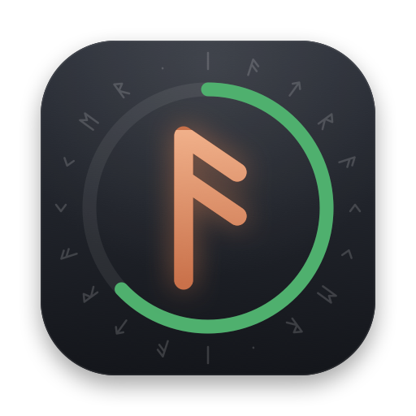
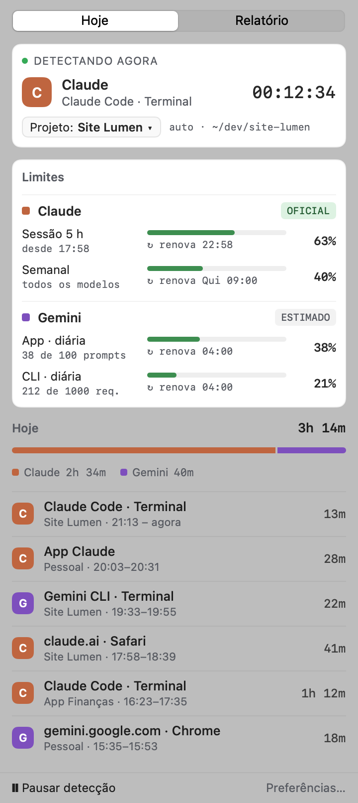
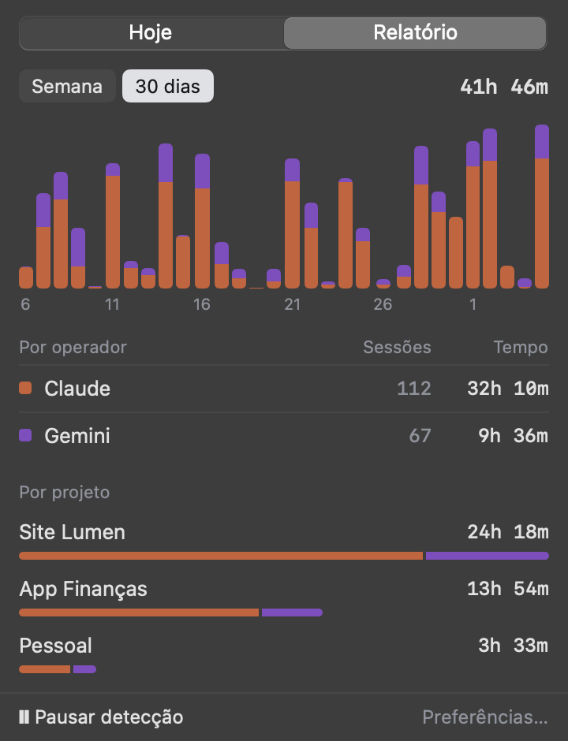
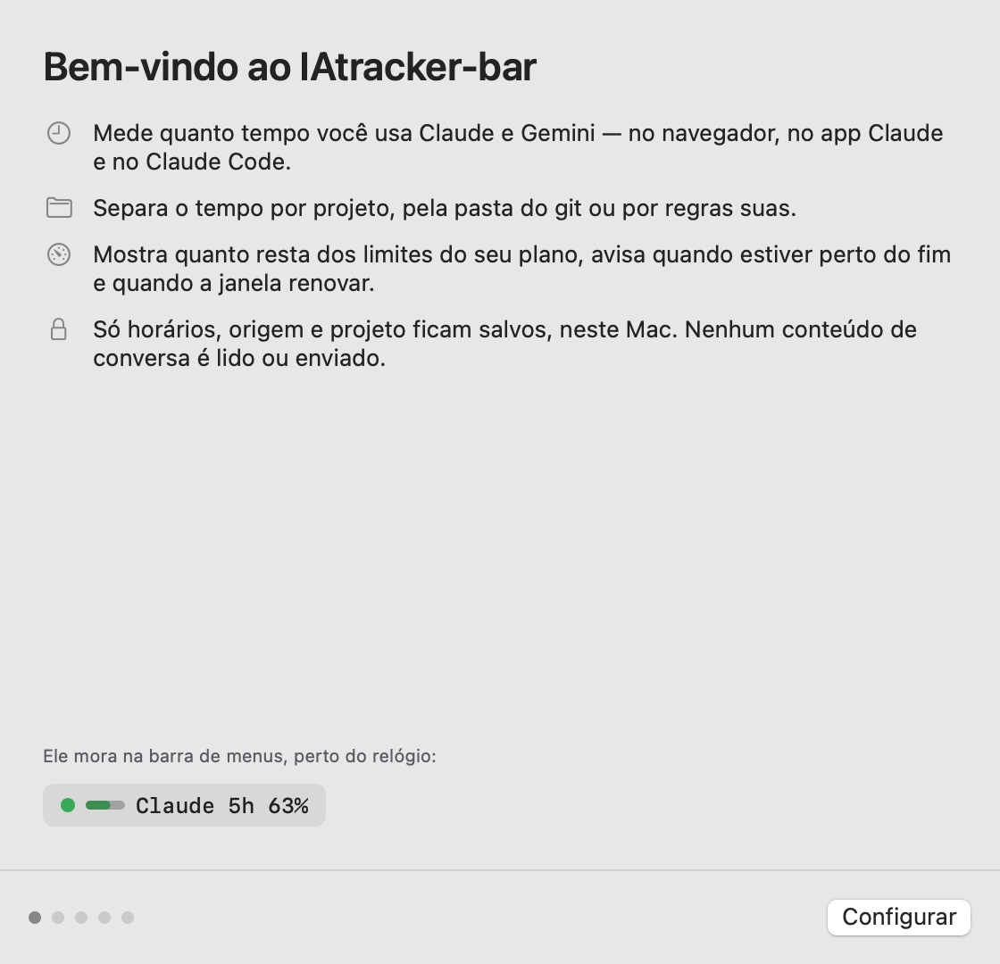
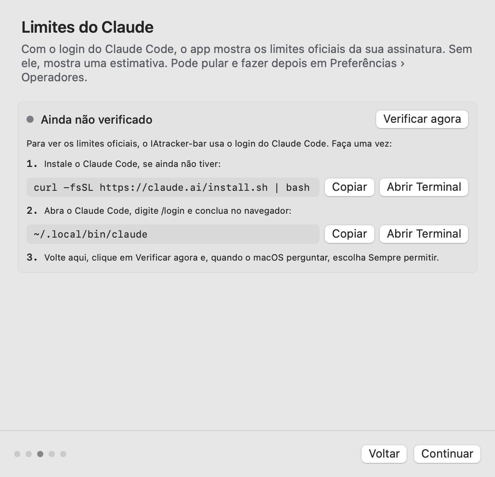
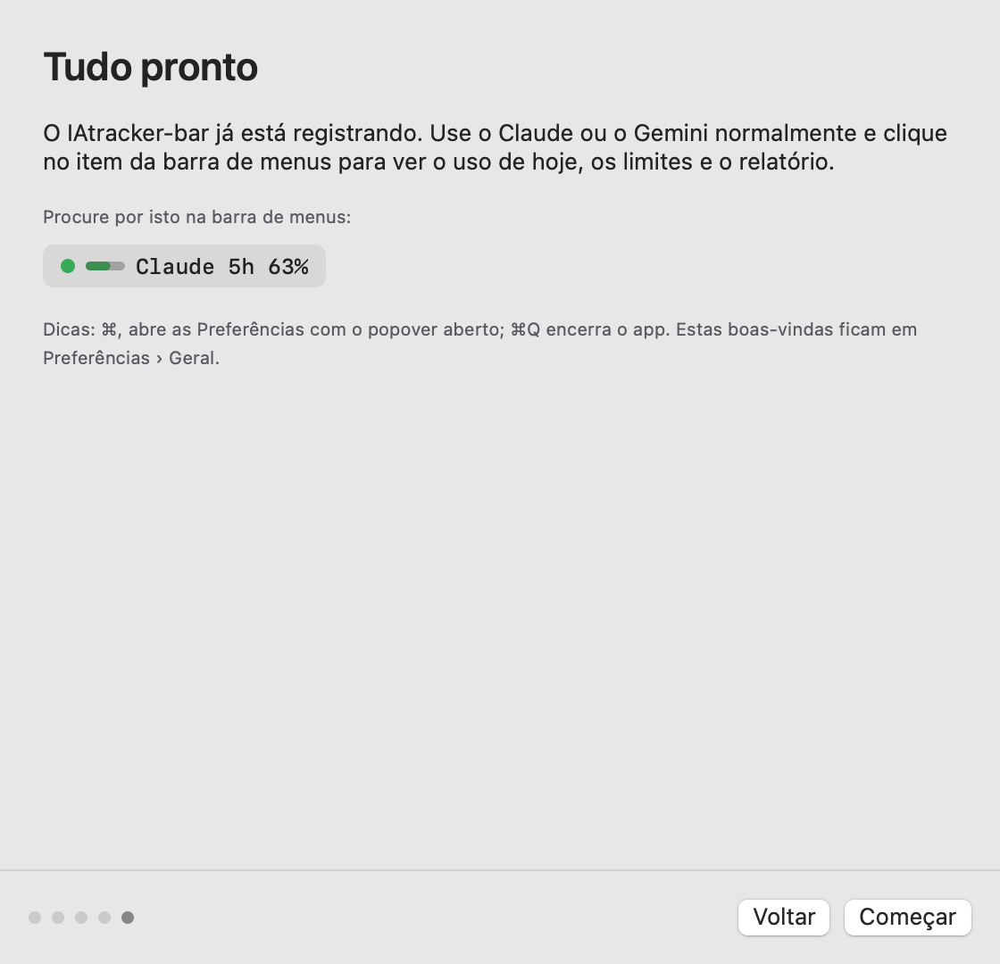

<p align="center">
  
</p>

# IAtracker-bar

[](https://github.com/lmtortelli/iatracker-bar/actions/workflows/ci.yml)
[](https://github.com/lmtortelli/iatracker-bar/releases)

**Quanto tempo você passa com IA, em qual projeto e quanto ainda resta do seu plano — na barra de menus do Mac.**

O IAtracker-bar é um app nativo de barra de menus para macOS que registra sozinho o uso do **Claude** e do **Gemini** (no navegador, no app Claude, no Claude Code e no Gemini CLI), separa o tempo por projeto e mostra os limites do plano — com aviso quando estiver perto do fim e quando a janela renovar.

<p align="center">
  
</p>

<p align="center">
  
  &nbsp;
  
</p>

<sub>Imagens geradas pelo próprio app em modo demonstração, com dados fictícios.</sub>

> O logo é **ᚨ Ansuz**, a runa de Odin no Futhark Antigo — sabedoria, comunicação, a voz — cuja haste é **ᛁ Isa**: juntas, **I** e **A**. Ela aparece gravada em cobre numa pedra rúnica, dentro de um medidor de uso, com IATRACKER escrito em runas na borda (ᛁᚨᛏᚱᚨᚲᚲᛖᚱ). Vetor em [`docs/logo.svg`](docs/logo.svg).

## O que ele faz

- **Detecta o uso sozinho.** claude.ai, gemini.google.com e aistudio.google.com no Safari, Chrome, Arc, Brave e Edge; o app Claude; o Claude Code e o Gemini CLI pelos logs locais. Ociosidade de 2 min encerra a sessão.
- **Separa por projeto.** Pela pasta do repositório git onde o Claude Code roda, por regras (pasta, endereço, título) ou escolhendo no menu **Projeto ▾**.
- **Mostra os limites.**
  - **Claude — oficial:** sessão de 5 h e semanal da sua assinatura, via login do Claude Code.
  - **Claude — estimado:** sem login, a janela de 5 h é estimada pelos tokens do Claude Code.
  - **Gemini — estimado:** cota diária do app (configurável) e do CLI (1000 requisições/dia), zerando à meia-noite do Pacífico.
- **Avisa.** Notificação perto do limite (padrão 80%), ao atingir 100% e quando a janela renova depois de um uso alto (padrão: acima de 90%). Tudo configurável em **Preferências › Avisos**.
- **Relatório.** Semana ou 30 dias, por operador e por projeto.
- **Privado.** Só horários, origem e projeto ficam salvos, neste Mac. Nenhum conteúdo de conversa é lido ou salvo.

## Instalação

Requer **macOS 13 (Ventura) ou mais novo**, Apple Silicon ou Intel.

1. Baixe o `IAtracker-bar-<versão>.zip` em [Releases](https://github.com/lmtortelli/iatracker-bar/releases) e descompacte.
2. Arraste **IAtracker-bar.app** para a pasta **Aplicativos**.
3. O app não é notarizado pela Apple, então o macOS bloqueia a primeira abertura. Libere com:
   ```bash
   xattr -dr com.apple.quarantine /Applications/IAtracker-bar.app
   ```
4. Abra o IAtracker-bar. Ele aparece na **barra de menus**, perto do relógio — não no Dock.

## Primeira execução

Na primeira abertura, uma janela de boas-vindas guia a configuração em cinco passos (todos podem ser pulados e refeitos em **Preferências › Geral**):

| | |
|---|---|
|  | **1. Boas-vindas** — o que o app faz, o que fica salvo e como achar o item na barra de menus. |
| | **2. Navegadores** — um botão **Permitir** por navegador instalado. O macOS pergunta se o IAtracker-bar pode controlar o navegador: isso serve só para ler o endereço da aba ativa. |
|  | **3. Limites do Claude** — o app verifica se há login no Claude Code. Se não houver, mostra os comandos para copiar e o botão **Verificar agora**. |
| | **4. Ajustes rápidos** — métrica da barra, cota diária do Gemini e abrir junto com o Mac. |
|  | **5. Pronto** — clique no item da barra para ver o uso de hoje, os limites e o relatório. |

### Limites oficiais do Claude

Os limites oficiais usam o login do **Claude Code** (o mesmo `/login` do terminal). Faça uma vez:

```bash
curl -fsSL https://claude.ai/install.sh | bash
```
```bash
~/.local/bin/claude
```
Dentro do Claude Code, digite `/login`, conclua no navegador e saia com `/exit`. Depois, em **Preferências › Operadores**, clique em **Verificar agora** e, quando o macOS perguntar sobre “Claude Code-credentials”, escolha **Sempre permitir**.

> ⚠️ A consulta de limites usa um endpoint **não documentado** da Anthropic (`api.anthropic.com/api/oauth/usage`). Ele pode mudar ou parar de funcionar sem aviso; nesse caso o app mostra o último dado válido e depois volta para a estimativa. O token nunca é renovado, gravado ou registrado pelo IAtracker-bar.

### Permissões

| Permissão | Para quê | Obrigatória? |
|---|---|---|
| Automação (por navegador) | Ler o endereço da aba ativa | Para contar o uso no navegador |
| Keychain — “Claude Code-credentials” | Ler o token do Claude Code para consultar os limites | Para os limites oficiais do Claude |
| Notificações | Avisos de limite e de renovação | Para os avisos |
| Acessibilidade | Ler o título da janela do app Claude (regras de projeto por título) | Não |

O status de cada uma fica em **Preferências › Permissões**. Como o app é assinado localmente (sem certificado da Apple), uma versão nova pode pedir as permissões de novo.

## Usando

- **Clique no item da barra** para abrir o popover. A aba **Hoje** mostra o que está sendo detectado agora e os **limites**; o histórico do dia (tempo por operador e sessões) fica recolhido — clique em **› Hoje** para abrir; ao fechar o popover ele volta recolhido. A aba **Relatório** mostra semana e 30 dias.
- **Projeto ▾** troca o projeto da sessão atual ou cria um novo.
- **❙❙ Pausar detecção** para tudo até você retomar.
- **Sair** no rodapé do popover (ou **⌘Q**) encerra o app; **⌘,** abre as Preferências.
- Só uma cópia do app roda por vez: abrir de novo apenas lembra que ele já está na barra de menus.

## Privacidade

- Fica salvo só: início e fim de cada sessão, operador, origem (ex.: `claude.ai · Safari`), pasta de trabalho, projeto e contadores (tokens por hora do Claude Code, prompts do Gemini). Banco SQLite em `~/Library/Application Support/IAtracker-bar/`.
- URL e título da aba são usados na hora, para classificar e atribuir projeto, e descartados.
- Dos logs do Claude Code e do Gemini CLI, o app lê só data, pasta e uso de tokens; o texto das mensagens nunca é usado.
- A única chamada de rede é a consulta de limites do Claude, direto para a Anthropic. Não há telemetria.

## Desenvolvimento

Swift Package (SwiftUI + AppKit, [GRDB](https://github.com/groue/GRDB.swift)); compila só com as Command Line Tools, sem Xcode.

```bash
swift build                              # compila
swift run iatracker-tests                # testes (harness próprio: as CLT não têm XCTest)
swift run IAtrackerBar --demo            # roda com os dados fictícios do protótipo
swift run IAtrackerBar --snapshot docs/images   # gera as imagens deste README
scripts/build-app.sh                     # build/IAtracker-bar.app
scripts/install.sh                       # compila e instala/atualiza em /Applications (mantém os dados)
scripts/build-release.sh 0.1.0           # testes + app universal + build/IAtracker-bar-0.1.0.zip
scripts/next-version.sh                  # próxima versão pelos commits semânticos
swift scripts/make-icon.swift            # regenera o ícone (Resources/AppIcon.icns) e o logo (docs/)
scripts/test-versioning.sh               # testes do cálculo de versão
```

- `Sources/IAtrackerBarCore` — lógica testável: modelos, banco, detecção, sessões, leitura de logs, projetos, limites, avisos, relatório.
- `Sources/IAtrackerBar` — app: barra de menus, popover, preferências, coletores (app em foco, abas, ociosidade, FSEvents), Keychain e notificações.
- `Tests/` — testes e fixtures (logs fictícios e resposta anonimizada do endpoint de uso).
- `scripts/inspect-local-logs.py` e `scripts/probe-claude-usage.py` — inspecionam a estrutura dos logs locais e da resposta de limites sem imprimir conteúdo nem tokens.
- `CLAUDE.md` — arquitetura, decisões e formatos verificados. `design/` — handoff de design original.

## Versões e releases

Os releases são gerados automaticamente pelo GitHub Actions a partir de **commits semânticos** ([Conventional Commits](https://www.conventionalcommits.org/pt-br/)), seguindo o [SemVer](https://semver.org/lang/pt-BR/):

| Commit | Versão | Exemplo |
|---|---|---|
| `fix:` ou `perf:` | patch | 0.1.0 → 0.1.1 |
| `feat:` | minor | 0.1.0 → 0.2.0 |
| `feat!:` / `fix!:` ou `BREAKING CHANGE:` no corpo | major | 0.1.0 → 1.0.0 |
| `docs:`, `chore:`, `ci:`, `refactor:`, `test:`, `style:`, `build:` | nenhum release | — |

- **Pull request para `main`** ([`ci.yml`](.github/workflows/ci.yml)): build, suíte completa de testes, testes do versionamento e verificação de que o **título do PR** é semântico (ele vira a mensagem do commit no merge por squash).
- **Merge na `main`** ([`release.yml`](.github/workflows/release.yml)): roda a mesma suíte; se houver `feat`, `fix`/`perf` ou breaking change desde a última tag, calcula a versão (`scripts/next-version.sh`), gera o app universal e publica a tag `vX.Y.Z` com o `.zip` e as notas em [Releases](https://github.com/lmtortelli/iatracker-bar/releases).

Para conferir localmente qual seria a próxima versão:

```bash
scripts/next-version.sh
```

## Limitações conhecidas

- Uso simultâneo conta duas vezes (ex.: claude.ai aberto enquanto o Claude Code trabalha em segundo plano), exceto o caso do Claude Code dentro do próprio app Claude.
- Terminais não são detectados pela janela: o Claude Code e o Gemini CLI entram pelos logs.
- Gemini: o app web não informa uso, então os prompts são estimados (sessões × taxa); o CLI conta prompts, não chamadas de API.
- A estimativa do Claude usa um orçamento padrão até ser calibrada por uma leitura oficial.
